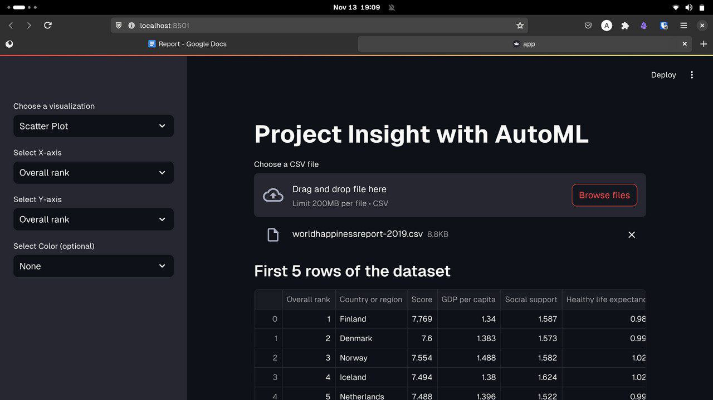
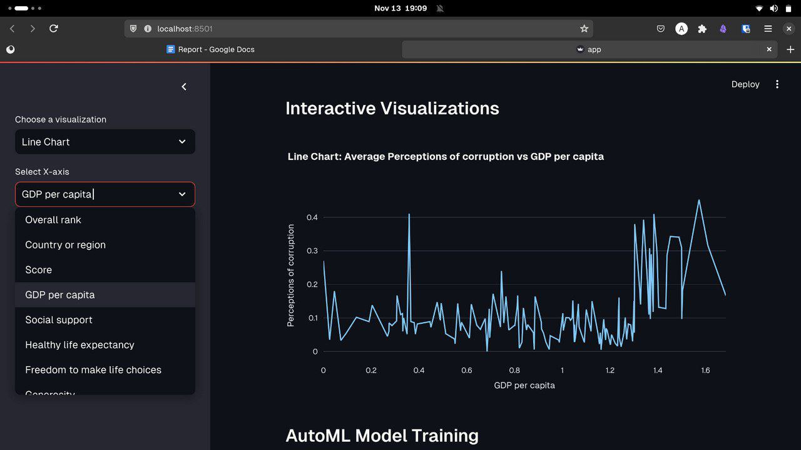
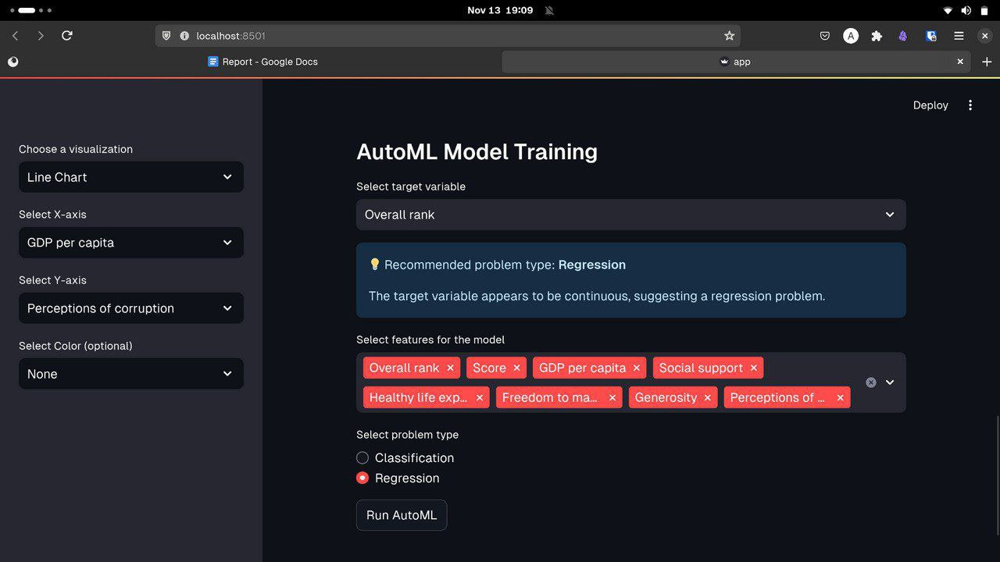
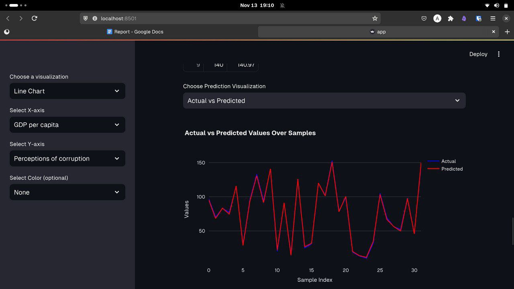

# Insight Engine: An Automated Machine Learning Platform

**Insight Engine** is an automated machine learning (AutoML) platform designed to simplify and accelerate the entire machine learning workflow.  It encompasses an intelligent feature engineering pipeline for efficient data preparation, a robust model selection system for evaluating various ML algorithms, and an interactive dashboard for real-time analytics across classification, regression, and time series tasks.

